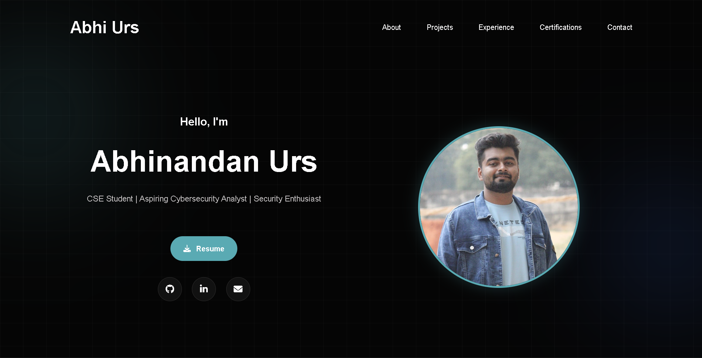
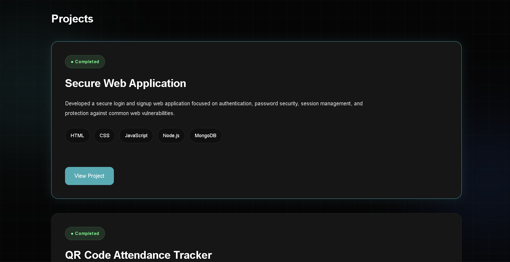
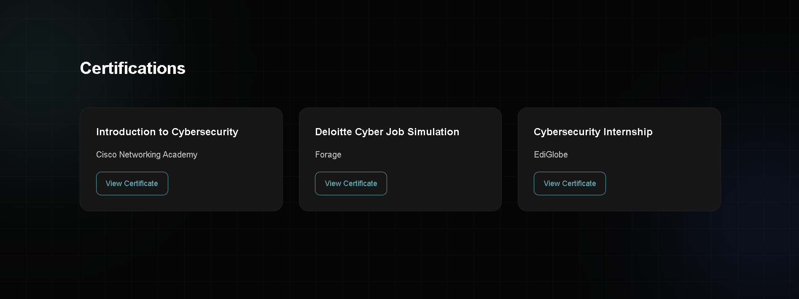

# Abhi Urs Portfolio Website

A modern cybersecurity-themed personal portfolio website showcasing my projects, certifications, technical skills, experience, and resume.

---

## 🌐 Live Website

Visit Portfolio: https://portfolio-website-xi-olive-17.vercel.app/

---

## 🚀 Features

- Responsive modern UI
- Cybersecurity-themed design
- Animated hero section
- Interactive project showcase
- Resume preview & download
- Certifications section
- Experience timeline
- Smooth scroll animations
- Hover effects and stagger animations
- Terminal-style mini section
- Project status labels
- Mobile responsive layout

---

## 🛠️ Technologies Used

- HTML5
- CSS3
- JavaScript
- Font Awesome
- Vercel

---

## 📂 Sections Included

- About
- Skills
- Certifications
- Projects
- Experience
- Education
- Currently Learning
- Achievements
- Resume
- Contact

---

## 💻 Projects Featured

### 🔐 Secure Web Application
A secure login and signup web application focused on authentication, password security, session management, and protection against common web vulnerabilities.

### 📱 QR Code Attendance Tracker
A QR-based attendance management system designed to automate student attendance tracking efficiently and securely.

### 🤖 AI-Driven Network Intrusion Detection System
An AI-powered cybersecurity project focused on detecting suspicious network activity and identifying potential threats using intelligent analysis techniques.

---

## 📸 Screenshots

### Hero Section

---

### Projects Section

---

### Certifications Section

---

## 📬 Contact

* Email: [ursabhi229@gmail.com](mailto:ursabhi229@gmail.com)
* GitHub: https://github.com/abhiurs
* LinkedIn: https://linkedin.com/in/abhinandanurs

---

## 👨‍💻 Author

Abhi Urs
